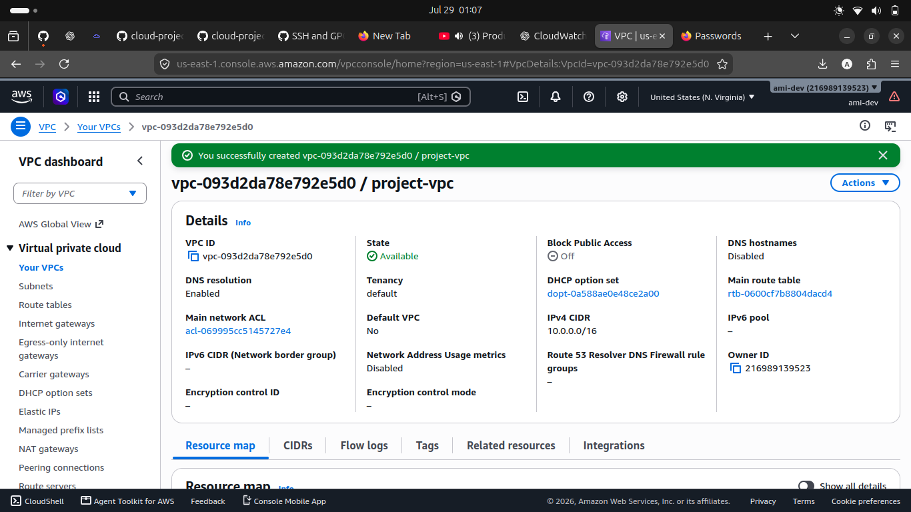
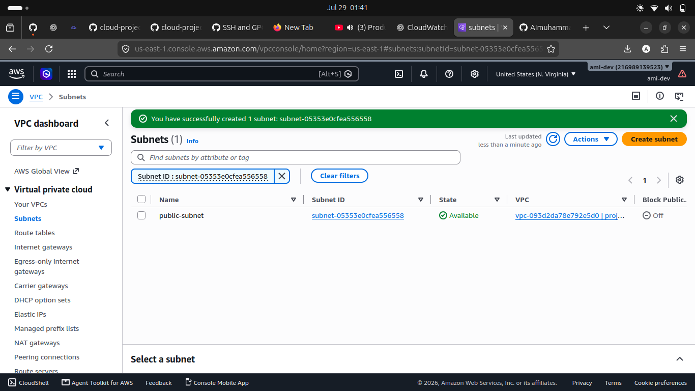

# AWS Custom VPC with Public and Private EC2

## Project Overview

This project demonstrates how to build a secure AWS network using Amazon VPC. The infrastructure includes public and private subnets, an Internet Gateway, route tables, security groups, and EC2 instances. An Apache web server is deployed on the public EC2 instance, while a private EC2 instance is accessible only through the public EC2.

---

## Architecture

### Components

- Custom VPC (10.0.0.0/16)
- Public Subnet (10.0.1.0/24)
- Private Subnet (10.0.2.0/24)
- Internet Gateway
- Public Route Table
- Private Route Table
- Public EC2
- Private EC2
- Apache Web Server

---

## AWS Services Used

- Amazon VPC
- Amazon EC2
- Internet Gateway
- Route Tables
- Security Groups
- SSH
- Apache HTTP Server

---

## Project Workflow

- ✅ Created Custom VPC
- ✅ Created Public Subnet
- ✅ Created Private Subnet
- ✅ Attached Internet Gateway
- ✅ Configured Route Tables
- ✅ Launched Public EC2
- ✅ Launched Private EC2
- ✅ Connected using SSH
- ✅ Installed Apache
- ✅ Hosted Website Successfully

---

## Screenshots

### Custom VPC

### Public Subnet

### Private Subnet

### Internet Gateway

### Apache Web Server

---

## Lessons Learned

During this project I learned:

- How Amazon VPC networking works.
- The difference between public and private subnets.
- How Internet Gateways provide internet connectivity.
- How route tables control network traffic.
- How to deploy EC2 instances into different subnets.
- How to connect securely using SSH.
- How to install and configure Apache on Amazon Linux.

---

## Skills Demonstrated

- AWS Networking
- Amazon EC2
- Linux Administration
- SSH
- Apache Web Server
- Git
- GitHub
- Infrastructure Documentation

---

## Project Status

✅ Completed
