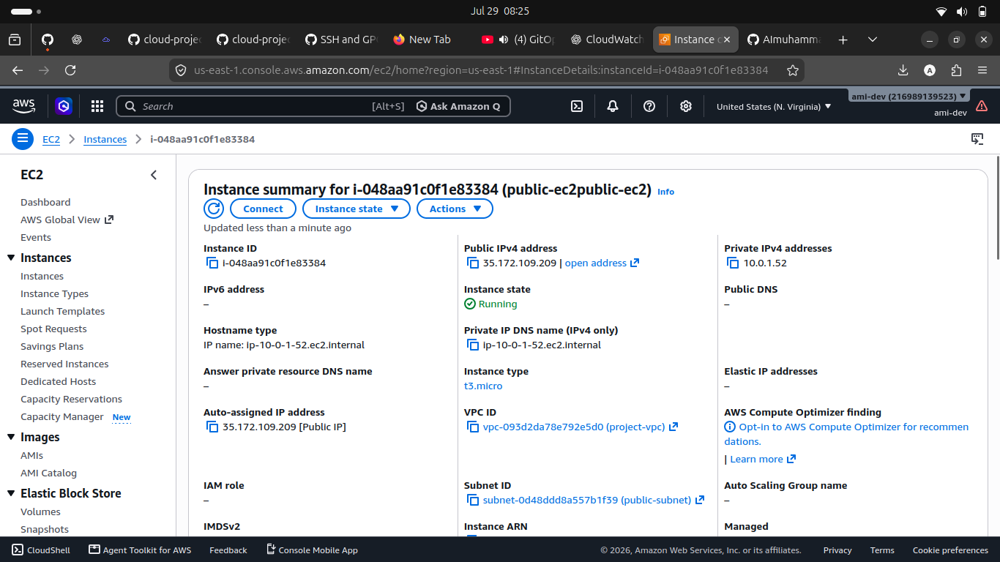
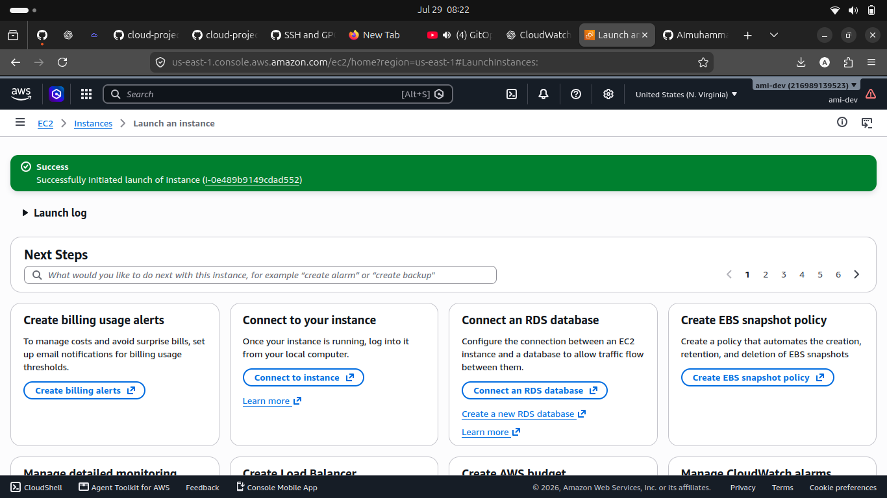
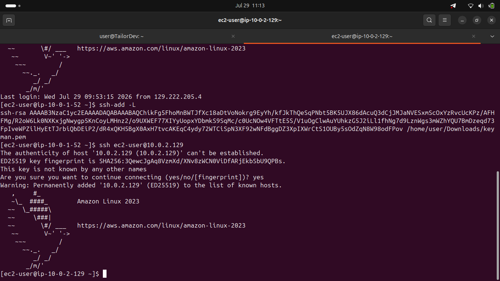
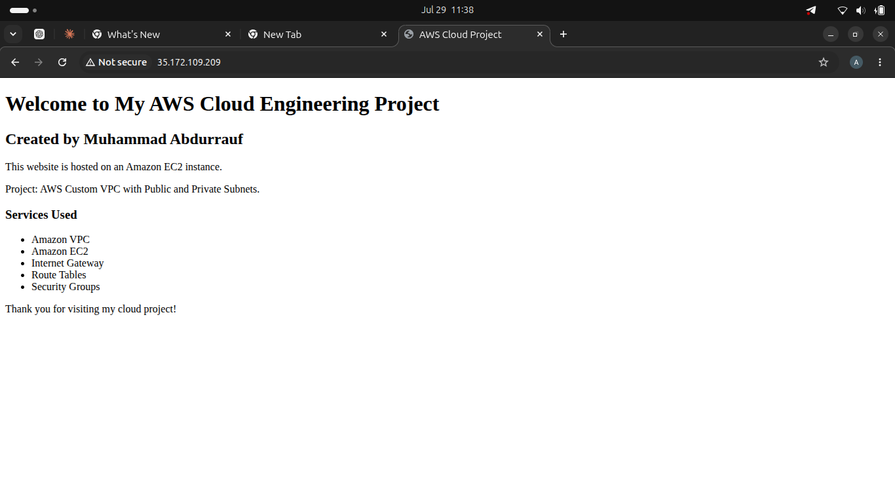

# AWS Custom VPC Project

## Objective

Design and deploy a custom Virtual Private Cloud (VPC) in AWS with secure network segmentation.

## Services Used

- Amazon VPC
- Amazon EC2
- Internet Gateway
- Route Tables
- Security Groups

## Architecture

The infrastructure includes:

- Public Subnet
- Private Subnet
- Internet Gateway
- Route Tables
- Public EC2 Instance
- Private EC2 Instance

## Project Progress

- ✅ Created Custom VPC
- ✅ Public Subnet
- ✅ Private Subnet
- ✅ Internet Gateway
- ✅ Route Tables
- ✅ Public EC2 Instance
- ✅ Private EC2 Instance
- ✅ Connectivity Testing
- ✅ Apache Web Server

## Screenshots

### Custom VPC

 ## Lessons Learned

- Learned how to create a custom VPC.
- Understood how CIDR blocks define network ranges.
- Learned why a VPC is the foundation of AWS networking.

### Public Route Table

### Private Route Table

### Public EC2

### Private EC2

### SSH to Private EC2

### Apache Web Server

## Status
🚧 Project in Progress
